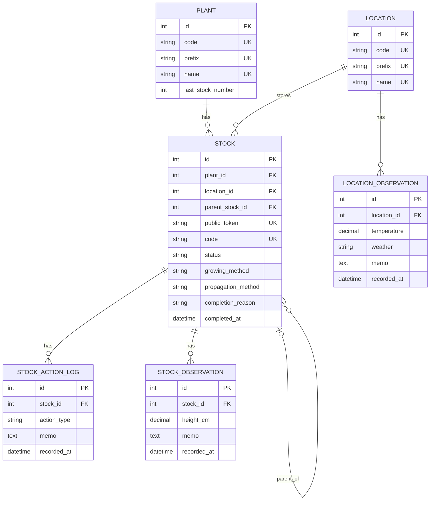

# ER図

basil-managerで管理する業務テーブルの関連を示します。
各テーブルのカラム、制約、業務ルールの詳細は、`db` 配下の仕様書を
参照してください。

- [`plants` テーブル](db/plant.md)
- [`stocks` テーブル](db/stock.md)
- [`locations` テーブル](db/location.md)
- [`stock_action_logs` テーブル](db/stock_action_log.md)
- [`stock_observations` テーブル](db/stock_observation.md)
- [`location_observations` テーブル](db/location_observation.md)

