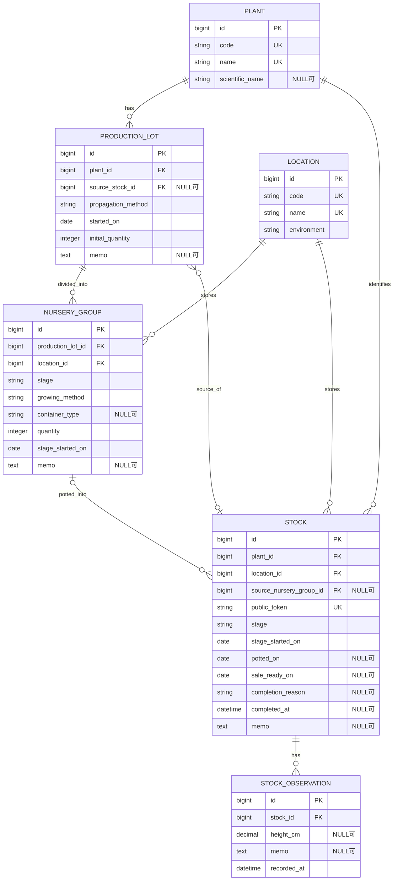

# ER図

basil-managerで管理する業務テーブルの関連を示します。
各テーブルのカラム、制約、業務ルールの詳細は、`db`配下の仕様書を
参照してください。

Plantごとに異なる、個体管理へ切り替える鉢上げを、NurseryGroupによる数量管理から
Stockによる個体管理へ移る境界とします。ProductionLotは生産の出自と開始条件、
NurseryGroupは鉢上げ前の現在工程と数量、Stockは鉢上げ後または購入・譲受による
直接登録の1株を表します。直接登録ではProductionLotとNurseryGroupを介しません。
鉢サイズを設定・検証する機能はv1の対象外です。

画像はActive Storageの内部テーブルで管理するため、この業務テーブルのER図には
含めません。Plant、Location、StockObservationがそれぞれ1枚の画像を添付できます。
Stock本体には画像を添付しません。StockObservationの`recorded_at`は必須です。

- [`plants` テーブル](db/plant.md)
- [`production_lots` テーブル](db/production_lot.md)
- [`nursery_groups` テーブル](db/nursery_group.md)
- [`stocks` テーブル](db/stock.md)
- [`locations` テーブル](db/location.md)
- [`stock_observations` テーブル](db/stock_observation.md)

```mermaid
erDiagram
    PLANT ||--o{ PRODUCTION_LOT : has
    PLANT ||--o{ STOCK : identifies
    STOCK o|--o{ PRODUCTION_LOT : source_of
    PRODUCTION_LOT ||--o{ NURSERY_GROUP : divided_into
    NURSERY_GROUP o|--o{ STOCK : potted_into
    LOCATION ||--o{ NURSERY_GROUP : stores
    LOCATION ||--o{ STOCK : stores
    STOCK ||--o{ STOCK_OBSERVATION : has

    PLANT {
        bigint id PK
        string code UK
        string name UK
        string scientific_name "NULL可"
    }

    PRODUCTION_LOT {
        bigint id PK
        bigint plant_id FK
        bigint source_stock_id FK "NULL可"
        string propagation_method
        date started_on
        integer initial_quantity
        text memo "NULL可"
    }

    NURSERY_GROUP {
        bigint id PK
        bigint production_lot_id FK
        bigint location_id FK
        string stage
        string growing_method
        string container_type "NULL可"
        integer quantity
        date stage_started_on
        text memo "NULL可"
    }

    STOCK {
        bigint id PK
        bigint plant_id FK
        bigint location_id FK
        bigint source_nursery_group_id FK "NULL可"
        string public_token UK
        string stage
        date stage_started_on
        date potted_on "NULL可"
        date sale_ready_on "NULL可"
        string completion_reason "NULL可"
        datetime completed_at "NULL可"
        text memo "NULL可"
    }

    LOCATION {
        bigint id PK
        string code UK
        string name UK
        string environment
    }

    STOCK_OBSERVATION {
        bigint id PK
        bigint stock_id FK
        decimal height_cm "NULL可"
        text memo "NULL可"
        datetime recorded_at
    }
```
